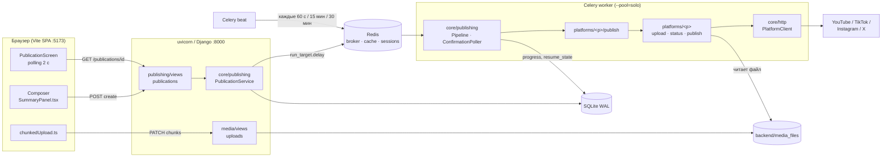
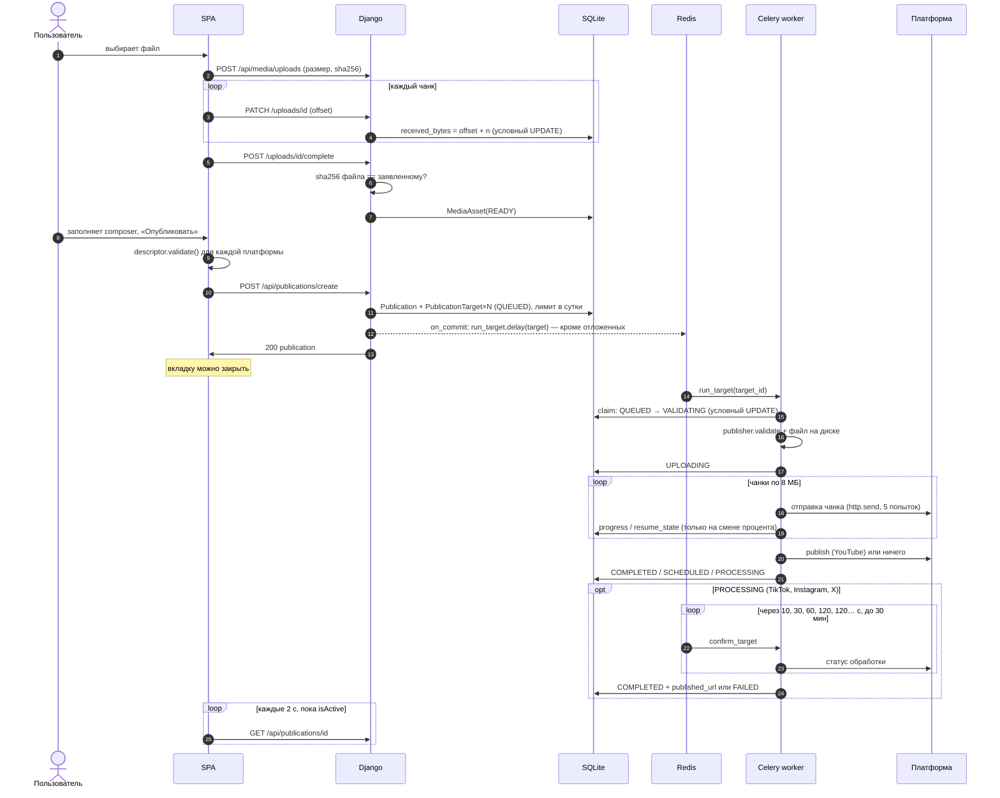
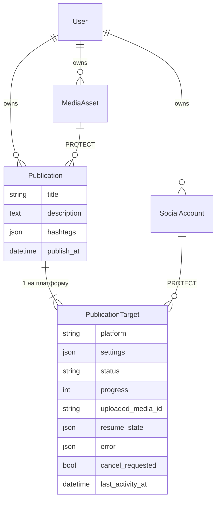
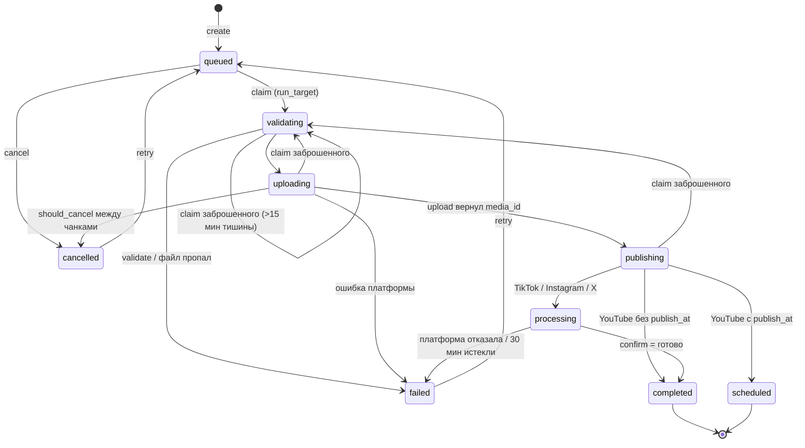
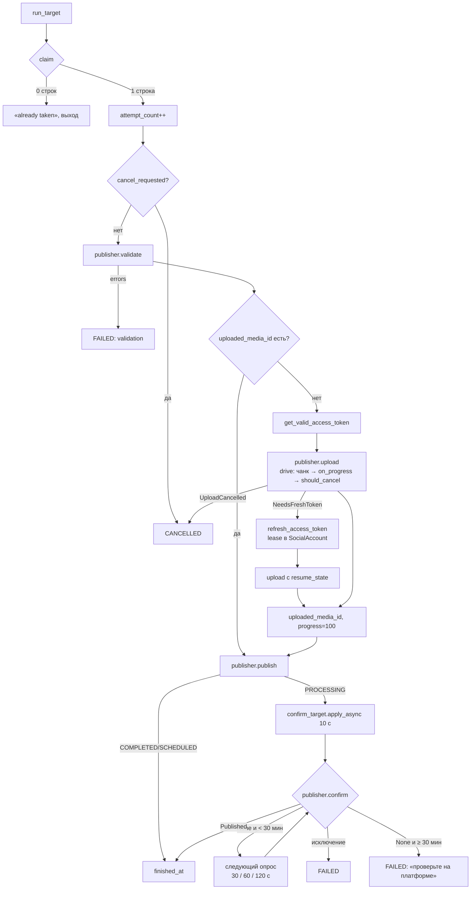
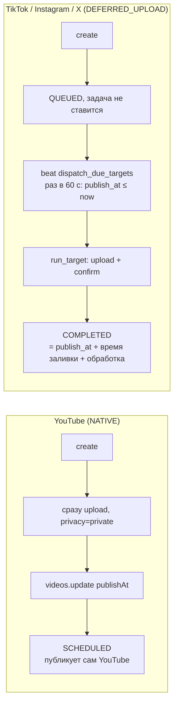
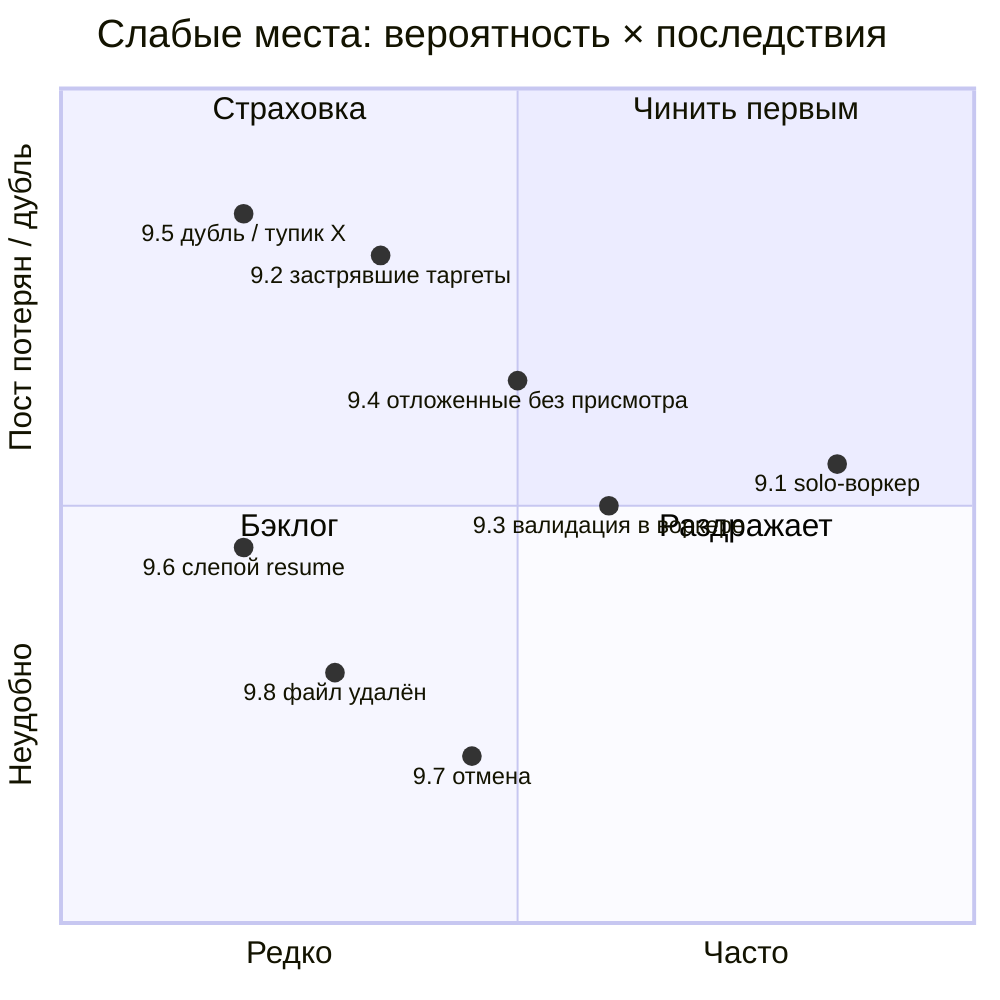

# Публикация видео: как устроено и где слабые места

Срез по состоянию кода на 2026-09-28, после переноса логики в `backend/platforms`
(`docs/adr/0002-platforms-core.md`). Документ описывает
путь видео от диска пользователя до четырёх платформ (YouTube, TikTok,
Instagram, X) и перечисляет найденные слабые места с указанием файлов.

> **Срез устарел в деталях.** После `docs/adr/0003-async-platforms.md` платформы
> работают на asyncio (`AuthorizationInteractor` / `PublishInteractor`),
> сценарии лежат в `services/usecases/` (`docs/adr/0004-services-package.md`), загрузка не возобновляется
> (зависшие цели переводит в failed `StaleTargetSweeper`), `resume_state`
> переименован в `confirmation_state` и хранит только подтверждение, а
> `FailureType` заменён на `PlatformFailure`. Пути файлов и описание resume
> ниже относятся к прежней реализации; потоки статусов и подтверждения
> остались прежними.

Общие решения (почему Django без DRF, почему polling, почему SQLite) — в
`docs/architecture.md` и `docs/adr/0001-web-migration.md`. Здесь — именно поток
публикации.

---

## 1. Компоненты

Слои на сервере: `views / tasks → platforms/core (use cases, через порты) → Publisher → platforms/
 → core/http`.
Django-приложения реализуют порты (`publishing/repositories.py`, `social/repositories.py`,
`publishing/queue.py`), сборка — `config/wiring.py`.
Платформенные пакеты не знают про модели Django; `Publisher` переводит
`PublicationTarget` в вызовы пакета.

---

## 2. Сквозной сценарий

---

## 3. Модель данных

`PublicationTarget` — единица работы. Вся машина состояний, прогресс, точка
возобновления и ошибка живут в одной строке.

---

## 4. Машина состояний `PublicationTarget`

Правила переходов (`platforms/core/publishing/pipeline.py`, `confirmation.py`, `service.py`):

- **claim** — условный `UPDATE ... WHERE status=queued OR (running AND last_activity < now-15m)`.
  Строка, которую обновил UPDATE, принадлежит воркеру; вторая доставка той же
  задачи ничего не находит.
- **cancel** запрещён в `processing` (`PublicationService.cancel`). Во время
  загрузки он лишь ставит флаг, который проверяется между чанками.
- **retry** сбрасывает статус в `queued`, но сохраняет `uploaded_media_id` и
  `resume_state` — повтор после сбоя на шаге publish не перезаливает файл.

---

## 5. Pipeline одного таргета

Классификация ошибок — в `platforms/core/http/failures.py::FailureClassifier`:

| HTTP | Тип | Повтор внутри `http.send` |
| --- | --- | --- |
| 401 | `authentication` | нет → `NeedsFreshToken` → один refresh |
| 403 | `authorization` | нет |
| 429 | `rate_limit` | да |
| 400/404/409/422 | `validation` | нет |
| 5xx, 408, сетевые | `platform` / `network` | да, 5 попыток, backoff 1→30 c с jitter |

Ретрай есть только на уровне одного HTTP-запроса. У Celery-задачи
`max_retries=0` — решение о повторе всей публикации принимает человек кнопкой
retry.

---

## 6. Платформы

| | YouTube | TikTok | Instagram | X |
| --- | --- | --- | --- | --- |
| Scheduling | `NATIVE` | `DEFERRED_UPLOAD` | `DEFERRED_UPLOAD` | `DEFERRED_UPLOAD` |
| Протокол загрузки | resumable session URI, `Content-Range` | init → `upload_url`, N чанков PUT | контейнер → `rupload` с `offset` | `initialize → append(segment) → finalize` |
| Откуда берётся offset при resume | спрашивает у YouTube (`bytes */size`) | из своего `resume_state` | спрашивает `bytes_transferred` | из своего `resume_state` |
| Срок жизни сессии | ~неделя (Google) | 55 мин (`upload_url`) | 23 ч (контейнер) | 23 ч (media) |
| Шаг publish | `videos.update` status / publishAt | нет (publish идёт сразу в init) | `media_publish` в `confirm` | `POST /tweets` в `confirm` |
| `confirm` | не нужен | `status/fetch` до `PUBLISH_COMPLETE` | ждёт `FINISHED`, затем publish | ждёт `succeeded`, затем создаёт пост |
| Неидемпотентный шаг | — | init (новый `publish_id`) | `media_publish` | `POST /tweets` |

### Отложенная публикация

### Защита от дубля неидемпотентного шага (сейчас — X)

`POST /tweets` не идемпотентен. `XPublisher.confirm` отвечает `ReadyToCommit`,
и `CommitGuard` в ядре перед `commit` пишет `commit_started` в `resume_state`.
Если ответ не пришёл (network / 5xx), таргет падает с «пост мог быть создан,
проверьте X». Любой следующий `confirm` с этой отметкой спрашивает
`publisher.resolve_uncertain` (у X — `None`) и повторяет ту же ошибку.

---

## 7. Фоновые процессы (beat)

| Задача | Период | Что делает |
| --- | --- | --- |
| `publishing.dispatch_due_targets` | 60 c | ставит в очередь `QUEUED`-таргеты отложенных платформ, чьё время пришло; подбирает `PROCESSING`, не опрошенные > 5 мин |
| `social.refresh_expiring_tokens` | 30 мин | обновляет токены, истекающие в ближайший час |
| `media.sweep_upload_sessions` | 15 мин | закрывает брошенные браузерные загрузки |
| `media.sweep_unused_assets` | 60 мин | удаляет файлы: не опубликованные 48 ч или все таргеты завершены 48 ч назад |

---

## 8. Что сделано хорошо

- **Effectively-once поверх at-least-once.** `acks_late` + условный UPDATE в
  `claim_queued_target`, `claim_confirmation_poll`, `claim_due_targets`, refresh lease. Паттерн
  переносится на PostgreSQL без изменений.
- **Возобновление вместо перезаливки.** `resume_state` пишется вместе с
  прогрессом; YouTube и Instagram при resume спрашивают реальный offset у
  платформы.
- **Нет повторов того, что решила платформа.** 4xx не ретраятся, задача Celery
  не ретраится вообще.
- **Единый контракт платформы.** `Session` + `drive`, `Publisher` с
  `validate / upload / publish / confirm`; пайплайн не знает, какая платформа.
- **Токены под контролем.** Refresh с lease, чтобы два воркера не сожгли
  refresh token; `NeedsFreshToken` несёт состояние загрузки.
- **Нет транзакций через сеть**, запись прогресса только на смене процента.

---

## 9. Слабые места

Отсортировано по тому, насколько вероятно столкнуться на практике.

### 9.1. Один воркер `--pool=solo` — всё идёт в одну очередь

`--pool=solo` выполняет одну задачу за раз. В ту же очередь попадают заливки,
`confirm_target`, `dispatch_due_targets` и `refresh_expiring_tokens`.

Последствия:
- публикация на 4 платформы заливается **последовательно**; 4 ГБ × 4 = четыре
  полных чтения файла подряд;
- пока идёт длинная заливка на YouTube, `confirm_target` для TikTok ждёт в
  очереди — 30-минутное окно подтверждения (`CONFIRM_WITHIN_SECONDS`) считается
  по wall-clock и может истечь, пока воркер занят; таргет упадёт с «не
  подтвердилось», хотя видео опубликовано;
- отложенные публикации запускаются не в `publish_at`, а когда освободится
  воркер;
- `time.sleep` в backoff (`platforms/core/http/retry.py`, до 30 c × 5) и ожидание
  чужого refresh (`TokenService._await_other_refresh`, до 2 мин)
  блокируют весь воркер.

Варианты: отдельная очередь для коротких задач (`confirm`, `dispatch`,
`refresh`) и второй воркер на неё; на Linux — `--pool=threads`/`prefork` с
concurrency 2–4. Окно подтверждения считать от первого реального опроса, а не
от момента publish.

### 9.2. Таргет может навсегда застрять в `queued` или `uploading`

Воскрешение есть не для всех состояний:

| Состояние | Кто подберёт |
| --- | --- |
| `queued`, отложенная платформа | beat `dispatch_due_targets` ✅ |
| `processing` | beat `take_stalled_confirmations` ✅ |
| `queued`, немедленная публикация | **никто** |
| `validating` / `uploading` / `publishing` | только повторная доставка той же задачи брокером |

Сценарии:
- **Redis недоступен в момент `create`.** `dispatch` вызывается после коммита,
  `run_target.delay` бросает исключение — клиент получает 500, но
  `Publication` уже создана, таргеты висят в `queued` бесконечно. Retry для
  `queued` запрещён (`services.retry` принимает только failed/cancelled), помогает
  лишь cancel → retry.
- **Воркер убит посреди заливки.** Задача вернётся от брокера через
  `visibility_timeout` (3 ч) или при рестарте. Если она придёт раньше, чем
  через 15 минут с последней записи прогресса, `claim` её отклонит
  («already taken»), задача будет ack-нута — и больше никто таргет не поднимет.
- **Заливка дольше 3 часов** (медленный uplink, 4 ГБ) — брокер повторно выдаст
  задачу; сейчас это безопасно благодаря claim, но только пока прогресс
  пишется чаще 15 минут.

Вариант: в `dispatch_due_targets` добавить подбор любых `ACTIVE`-таргетов,
которые `_claimable()` (queued без недавней активности + running > 15 мин) —
claim уже умеет их брать.

### 9.3. Серверная валидация только в воркере

`publishing_create_publication` проверяет asset, аккаунты и `publishAt`, но не вызывает
`publisher.validate` и не проверяет `settings`. Проверки дублированы в
TypeScript (`descriptor.validate` в `SummaryPanel.tsx`).

- Для отложенной публикации ошибка «подпись слишком длинная» или «приватность
  недоступна» всплывёт только в момент `publish_at` — ночью, без человека.
- TS и Python могут разъехаться (контрактный тест есть только для дефолтов
  YouTube).
- `settings` — произвольный `dict`; кривые значения ловятся только
  `video_options_of` в воркере.

Вариант: вызывать `publisher_for(p).validate(target)` в `create_publication`
(это чистая функция без сети) и возвращать `invalid` с ошибками по платформам.

### 9.4. Отложенная публикация для TikTok / Instagram / X неточна и хрупка

- Видео появляется в `publish_at + ≤60 c beat + ожидание воркера + заливка +
  обработка платформой`. Для 1–2 ГБ это десятки минут опоздания.
- Все риски (токен отозван, аккаунт `needs_reauth`, платформа лежит, файл
  удалён) реализуются в момент публикации, когда никто не смотрит.
- Если beat не запущен, отложенные публикации не выходят вообще, и об этом
  ничего не сигнализирует.
- Уведомлений нет — о падении узнают, только открыв страницу.

Вариант минимум: заранее (например, за 30 мин) проверять токен и валидность;
показывать в UI «beat не отвечает» по возрасту последнего `dispatch`.

### 9.5. Неидемпотентные шаги и тупик после «может быть опубликовано»

- **X**: после неотвеченного `POST /tweets` таргет навсегда в состоянии «мог
  быть создан». `retry` возвращает его в `queued`, pipeline переносит отметку
  `commit_started` дальше, и `confirm` сразу падает той же ошибкой. Выйти можно
  только новой публикацией. Место для проверки «пост с этим media_id уже есть»
  теперь есть — `XPublisher.resolve_uncertain`, — но она не реализована, как нет
  и ручной отметки «я проверил, публикуй».
- **Instagram**: `media_publish` при retryable-ошибке возвращает `None`, и
  следующий опрос снова вызывает publish. Защищает статус контейнера
  `PUBLISHED`, но между двумя вызовами окно для дубля остаётся.
- **TikTok**: при истёкшем `upload_url` (55 мин) начинается новый `init` —
  старый `publish_id` остаётся висеть на стороне TikTok. `init` уже содержит
  `post_info`, т.е. это старт публикации, а не просто сессия загрузки.

### 9.6. Resume «вслепую» у TikTok и X

YouTube и Instagram при возобновлении спрашивают у платформы, сколько байт
принято. TikTok и X берут `next_chunk` / `next_segment` из `resume_state`,
который пишется только при смене целого процента. После падения воркера чанк
может уйти повторно. Для X `append` с тем же `segment_index` безопасен; для
TikTok повторный PUT уже принятого диапазона не проверен тестом.

### 9.7. Отмена и прогресс

- В `processing` отменить нельзя, хотя для X пост ещё не создан, а для
  Instagram контейнер ещё не опубликован.
- `should_cancel` делает запрос в SQLite на каждый чанк — дёшево, но отмена
  срабатывает только после текущего чанка (до 8 МБ × 5 попыток × backoff).
- Прогресс `PROCESSING` для пользователя — просто «обрабатывается», без
  номера опроса и оставшегося окна.

### 9.8. Жизненный цикл файла

- Файл удаляется через 48 ч после завершения всех таргетов. `retry` упавшего
  таргета через 3 дня закончится `FILE: видео больше нет на сервере`; UI
  кнопку retry при этом показывает.
- `MediaAsset` защищён `PROTECT`, но от удаления файла защищает только
  `finished_at IS NULL` — таргет, застрявший из-за 9.2, держит файл вечно.

### 9.9. SQLite и конкуренция

Сейчас записей мало (один воркер), и WAL справляется. Но если снять
ограничение 9.1 (несколько воркеров), одновременно будут писать:
прогресс N заливок, polling-запросы не пишут, но `last_activity_at` пишется
каждым `_set`. Это ровно тот триггер переезда на PostgreSQL, который описан в
`CLAUDE.md`. Решение 9.1 и переезд, скорее всего, придут вместе.

### 9.10. Мелочи

- Дневной лимит считается по `Publication`, а не по таргетам: публикация на
  4 платформы — одна единица лимита.
- `FailureMapper` для неизвестных исключений кладёт `str(exception)` в
  `target.error`, который уходит в SPA. Сетевые исключения заворачиваются
  заранее, но любое новое исключение с URL/телом в тексте попадёт к клиенту.

---

## 10. Сводка

Первые шаги, которые дают больше всего при минимальных изменениях:

1. Отдельная очередь (и воркер) для `confirm` / `dispatch` / `refresh` — снимает
   большую часть 9.1.
2. Подбор всех `_claimable()` таргетов в `dispatch_due_targets` — закрывает 9.2.
3. `publisher.validate` в `create_publication` — закрывает 9.3 и половину 9.4.
